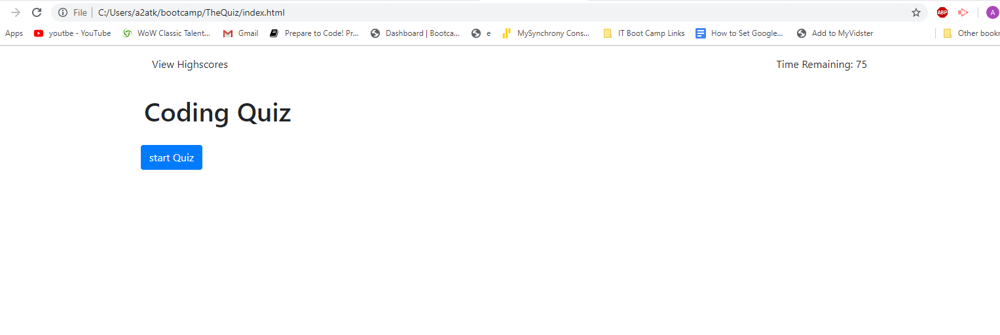
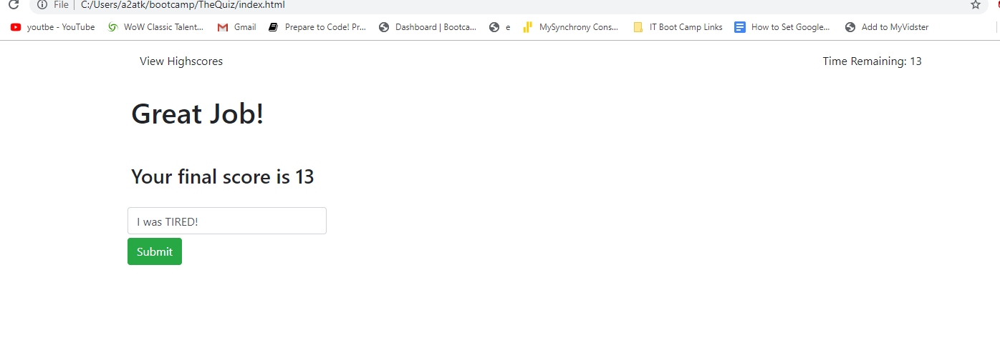
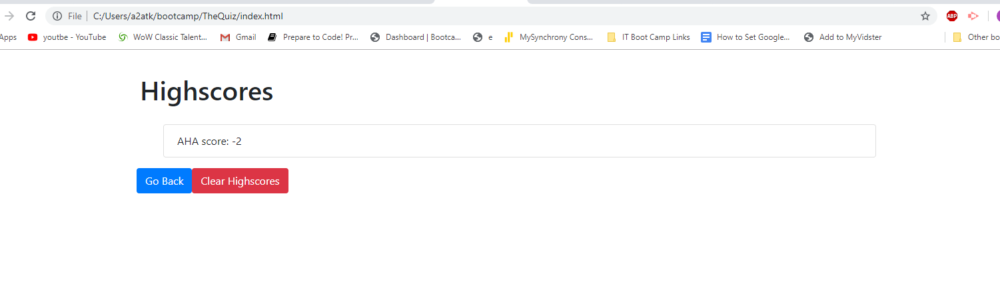

# TheQuiz

Hi! Welcome to my application. This simple application is here to test your coding genius! its been said that less than 1% of testers can score above 60. Good Luck!

## installation
* Here is the link to the [GitHub Repository](https://github.com/austinatkinson93/TheQuiz)
* Have a look at my [Bootstrap portfolio](https://austinatkinson93.github.io/TheQuiz/)

## Usage
The rules of the quiz are pretty simple: 

* When you are ready press the "Start Quiz" button on the start menu.

    

* You will have 75 seconds to answer 5 questions.
    - Each incorrect quiz answer will subtract 15 seconds from your total time, so read carefully! 

* After all the questions have been answered you will be given your score and asked for your initials.

    

* Your score will be saved and accessible by clicking "View Highscores" from the start menu Which will bring you to a page looking like the following image.

    

Its a simple application but I hope you enjoy it and Good Luck!

Enjoy!

## Credits 

Austin Atkinson: [GitHub](https://github.com/austinatkinson93)

## License

Copyright (c) [2019] [Austin Atkinson]

Permission is hereby granted, free of charge, to any person obtaining a copy
of this software and associated documentation files (the "Software"), to deal
in the Software without restriction, including without limitation the rights
to use, copy, modify, merge, publish, distribute, sublicense, and/or sell
copies of the Software, and to permit persons to whom the Software is
furnished to do so, subject to the following conditions:

The above copyright notice and this permission notice shall be included in all
copies or substantial portions of the Software.

THE SOFTWARE IS PROVIDED "AS IS", WITHOUT WARRANTY OF ANY KIND, EXPRESS OR
IMPLIED, INCLUDING BUT NOT LIMITED TO THE WARRANTIES OF MERCHANTABILITY,
FITNESS FOR A PARTICULAR PURPOSE AND NONINFRINGEMENT. IN NO EVENT SHALL THE
AUTHORS OR COPYRIGHT HOLDERS BE LIABLE FOR ANY CLAIM, DAMAGES OR OTHER
LIABILITY, WHETHER IN AN ACTION OF CONTRACT, TORT OR OTHERWISE, ARISING FROM,
OUT OF OR IN CONNECTION WITH THE SOFTWARE OR THE USE OR OTHER DEALINGS IN THE
SOFTWARE.